# Serving ML Models With FASTAPI, Redis, Kubernetes, Itsio, Grafana, and Consuming API within Flask

<!-- TOC tocDepth:2..3 chapterDepth:2..6 -->

- [Serving ML Models With FASTAPI, Redis, Kubernetes, Itsio, Grafana, and Consuming API within Flask](#serving-ml-models-with-fastapi-redis-kubernetes-itsio-grafana-and-consuming-api-within-flask)
  - [Visual Overviews](#visual-overviews)
    - [Minikube Setup](#minikube-setup)
    - [Istio Sidecar Container and Envoy Proxy](#istio-sidecar-container-and-envoy-proxy)
    - [What Fast API Looks Like](#what-fast-api-looks-like)
    - [What the Flask Web Application Looks Like](#what-the-flask-web-application-looks-like)
  - [System Requirements](#system-requirements)
  - [Installing Pre-Requisites](#installing-pre-requisites)
    - [Script for Automated Install](#script-for-automated-install)
  - [The `run.sh` Bash Script](#the-runsh-bash-script)
  - [Running the System from Scratch](#running-the-system-from-scratch)
    - [Happy Result](#happy-result)
    - [Error Condition](#error-condition)
  - [Monitoring Load Testing](#monitoring-load-testing)
  - [Running Load Testing Independently](#running-load-testing-independently)
  - [Using Github Actions to Test the System](#using-github-actions-to-test-the-system)
  - [Tearing Down The System After Use](#tearing-down-the-system-after-use)

<!-- /TOC -->


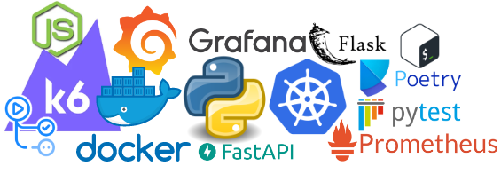

This system is designed to demonstrate how to serve ML Models utilizing FASTAPI within docker containers served out of a Kubernetes cluster (We use minikube for this demo).

Istio, Prometheus, and Grafana are used  within the Kubernetes clster in order to provide visibility to the inner workings of the cluster and its health.

A Flask Web Application is made available in order to demostrate to human users how to consume this API.

The system includes automated Load Testing of the Kubernetes Pod utilizing K6.

Github actions are used to test the health of the solution upon check-in, simulating a production CI/CD health check system.

The solution is a infrastructure as code pure-play.

## Visual Overviews

### Minikube Setup

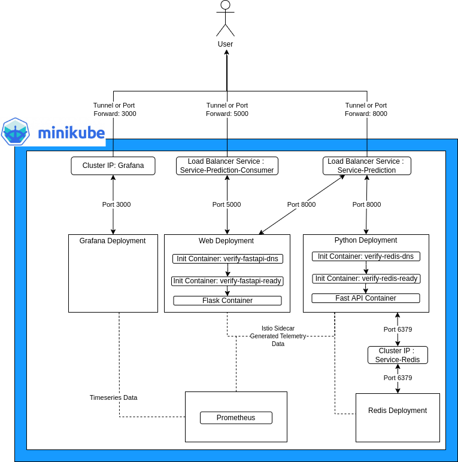

### Istio Sidecar Container and Envoy Proxy

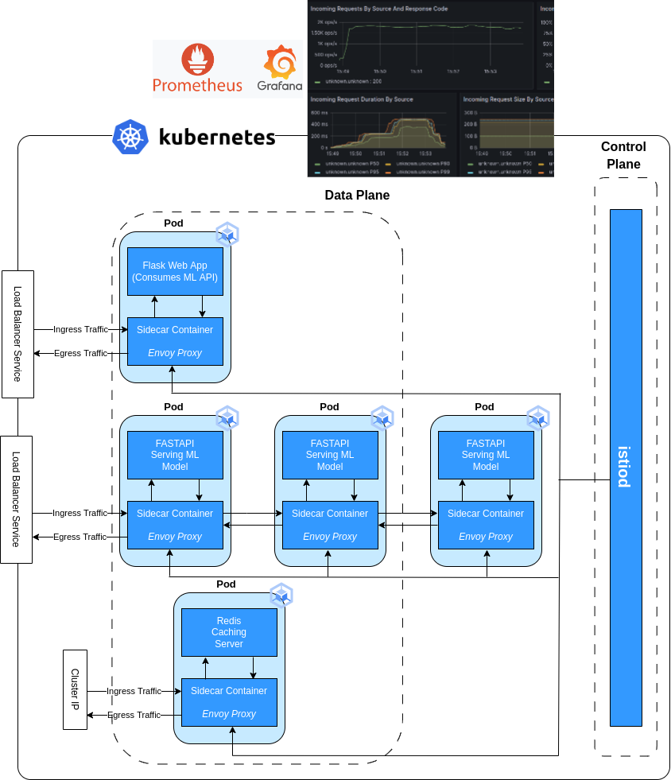

### What Fast API Looks Like

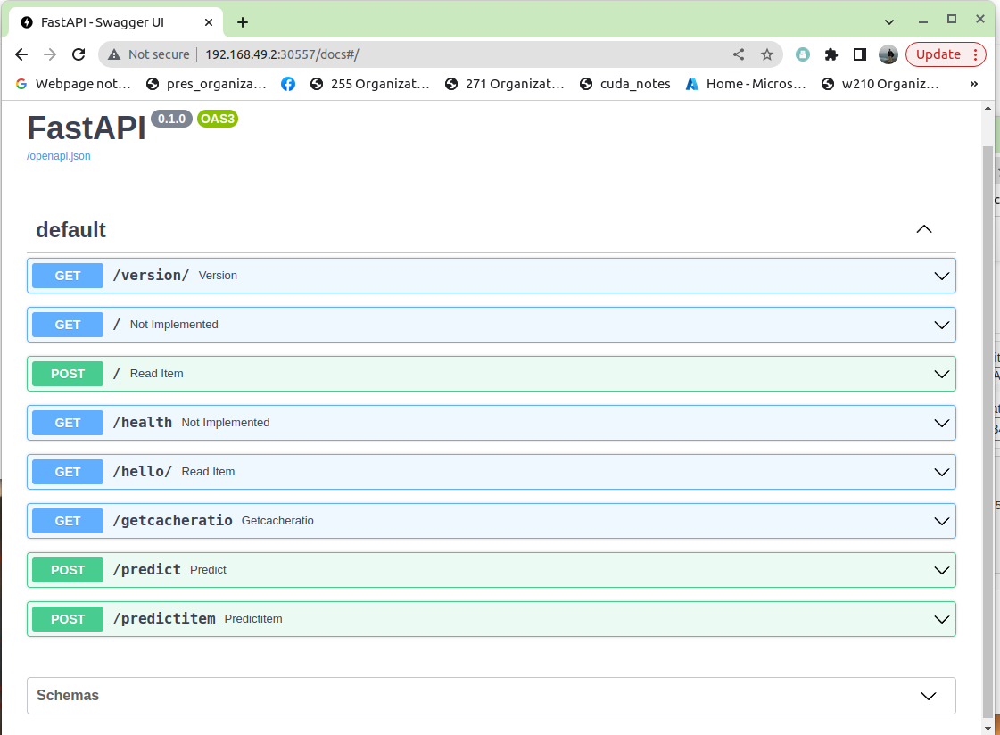

### What the Flask Web Application Looks Like

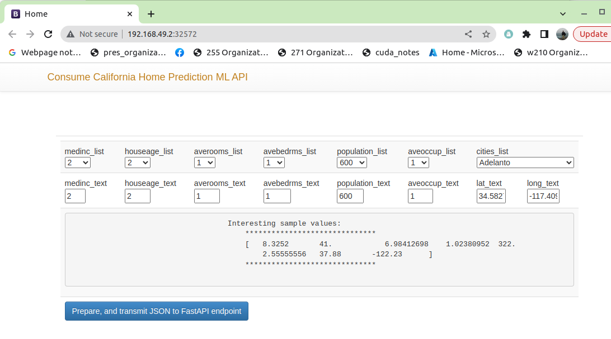


## System Requirements

This has been tested on a Linux Ubuntu Server running on a INTEL/AMD64/X86 instruction set microprocessor.

I would recommend a mininum of 16GB of memory to attemp to run this system.

It has not been tested on Mac or OSX.  Some of the exotic port forwarding features of this system require considerable finessing to get them to work on MacOS.

I have not had the time to create a distro for that environment.

If you wish to run this, but do not have a suitable computer, it has been tested on AWS EC2 Instances, Azure virtual machines, and GCP virtual machines.

## Installing Pre-Requisites

This system has many pre-requisites, git, python, docker, docker-compose, minikube, istio, kubectl, bash and others.

### Script for Automated Install

Run the following script as root in order to install all pre-reqs either locally, on a local virtual machine or within the cloud.

```
git clone https://github.com/Don-Irwin/fastapi_ml_k8_k6_gh_actions && cd ./fastapi_ml_k8_k6_gh_actions && sudo bash ./setup_deps.sh && source /home/ubuntu/.bashrc
```

Or step-by-step.

```
git clone https://github.com/Don-Irwin/fastapi_ml_k8_k6_gh_actions
```

```
cd ./fastapi_ml_k8_k6_gh_actions
```

```
sudo bash ./setup_deps.sh
```

```
source /home/ubuntu/.bashrc
```


Press Ctrl + Click on this link; [setup_deps.sh](https://github.com/Don-Irwin/fastapi_ml_k8_k6_gh_actions/blob/main/setup_deps.sh), to open the `setup_deps.sh` shell file, which will up all of the dependencies on a "blank" server or Virtual Machine with the latest version of Ubuntu.

## The `run.sh` Bash Script

The `run.sh` bash script is fairly exhaustive and orchestrates the system end-to-end.

It is the entry-point for the system.

## Running the System from Scratch

Once the pre-requisites are installed on the system running the system end-to-end, should be straightforward.

Utilize this command to clone, and run the system:

* All in one shot.
```
git clone https://github.com/Don-Irwin/fastapi_ml_k8_k6_gh_actions && cd ./fastapi_ml_k8_k6_gh_actions && . run.sh

```

* Step by Step:
```
git clone https://github.com/Don-Irwin/fastapi_ml_k8_k6_gh_actions
```
then,
```
cd ./fastapi_ml_k8_k6_gh_actions
```
then,
```
. run.sh
```

### Happy Result

If the system is able to run end-to-end, we should see this message.


Upon seeing this message we should be able to open:

* Grafana -- in order to see the progress of the load testing (which will be running):
    Ctrl + Click -- to open in new tab.
   [Grafana http://localhost:3000](http://localhost:3000)
* The FASTAP swagger interface:
     Ctrl + Click -- to open in new tab.
    [FastAPI Interface http://localhost:8000](http://localhost:8000)
* The Flask Web Application:
     Ctrl + Click -- to open in new tab.
    [Flask Web Application http://localhost:5000](http://localhost:5000)


### Error Condition

If `run.sh` encounters an error condition should report it to the console and discontinue its running.

## Monitoring Load Testing

Peeking at `run.sh` we see that after all web interfaces are up it begins to run loadtesting:

```
echo "*********************************"
echo "*                               *"
echo "*  RUNNING Load testing         *"
echo "*  Look at. ...                 *"
echo "*  $this_grafana"
echo "*                               *"
echo "*********************************"

. run_k6.sh

```

Output is sent to a file, not the screen, but once it has completed the following message should show up indicating its status:

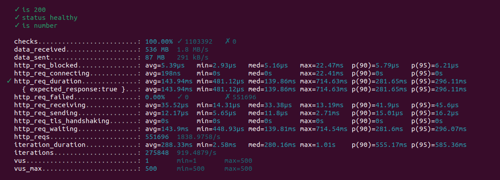

## Running Load Testing Independently

If we wish to run load testing independently we may do so, provided the system is still running.

To do this, we:
* 1. Open a new bash shell and move to that same directory.
* 2. run the file run_k6.sh:
```
. run_k6.sh
```

While this is running we should be able to open grafana:

[http://localhost:3000](http://localhost:3000)

Doing so, we will see the system under load within the dashboard.

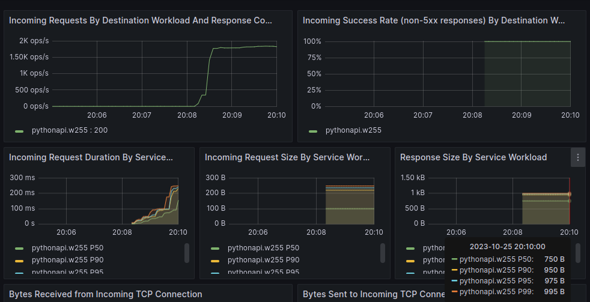

## Using Github Actions to Test the System

This repo includes a custom github action.

The YML for this workflow is located at:

([.github/workflows/merge_main.yml](https://github.com/Don-Irwin/fastapi_ml_k8_k6_gh_actions/blob/main/.github/workflows/merge_main.yml))

This custom github action does the following when a pull request is created from the branch `dev` into the branch `main`:

* Tests the dependency installation scripts.
* Tests the core functionality of the ML application.
* Tests the docker builds.
* Tests the minikube deployments.

Below is an example of checks being run at the time of creating a pull request from the branch `dev` into the branch `main`:

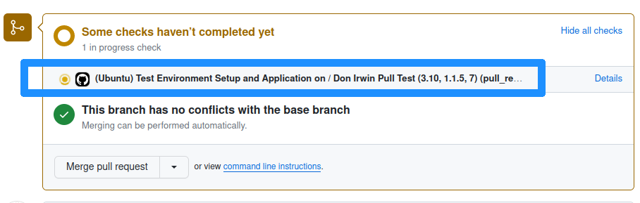

Below is an example of the test failing:

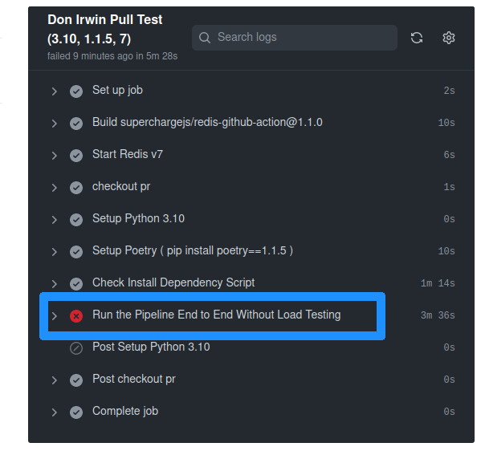

Below is an example of the test succeeding:

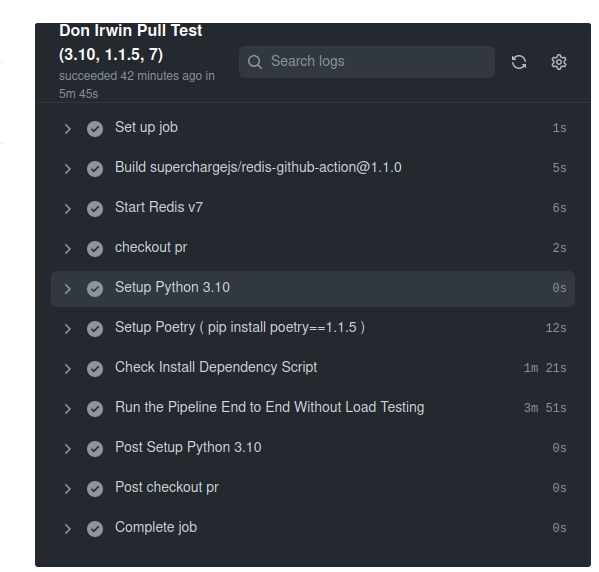

## Tearing Down The System After Use

Once the system has completed its load testing we should see this message.

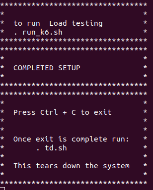

As the message instructs, we can press Ctrl + C, then we run the script `td.sh` -- this will tear down the system and turn off minikube.

